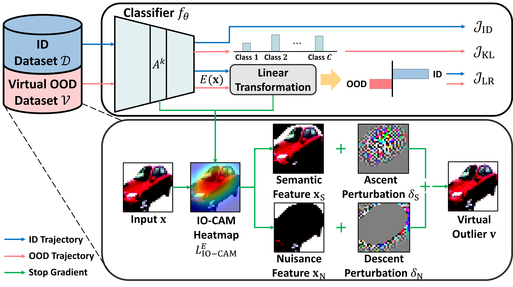

# EOD: Explainable outlier generation for Out-of-distribution Detection
This is the source code accompanying the paper **[*EOD*]**

## Informations
- python : 3.9.21
- CUDA : 11.3

## Requirements
```python
pip install -r requirements.txt
```
The related version for PyTorch and related library (e.g. torchvision) is based on cu113. Please adjust it according to the experimental environment.

## Executing code
```python
python train.py --data CIFAR10 \
                --model wrn \
                --start_epoch 80 \
                --thres 0.3 \
                --scale 5
```
**Explanation about arguments**
- --data: ID dataset.
- --model: Backbone architecture.
- --start_epoch: Start epoch for generate virtual outlier.
- --thres: Threshold for distinguish semantic and nuisance region by CAM.
- --scale: Adjust magnitude for FGSM-like virtual outlier generation.


